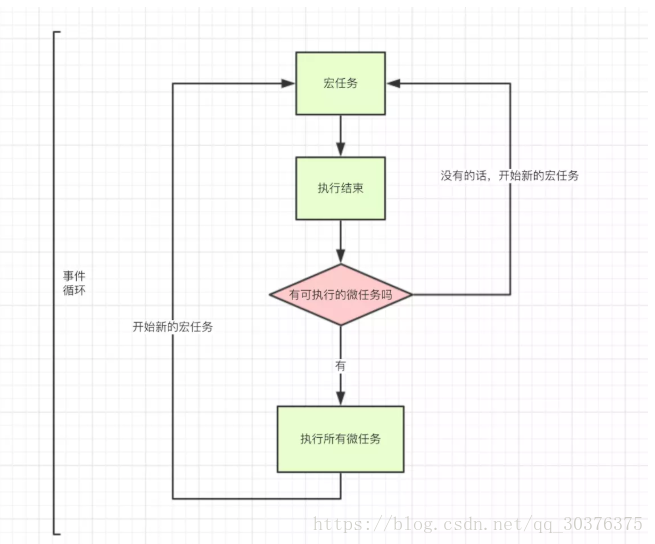

任务进入执行栈
区分同步任务还是民步任务，同步的进入主线程，异步任务放到Event table，当条件达成时，Event table会把该事件推入到Event queue
当主线程执行结束后，主线程读取任务队列Even queue里的事件。
event queue执行完毕后，继续回到主线程。循环反复。

## 二：深刻理解宏任务，微任务，

先宏任务（setTimeout, ），
再是微任务，

微任务中，

主线程 -> Promise(立即执行, 所以先于宏任务执行。) -> process.nextTick() -> Promise.prototype['then' || catch ……] -> setTimeout

[具体实例，看过csdn的一篇资料，感觉有点价值 ](https://blog.csdn.net/qq_30376375/article/details/82990588)

##  三: 对node不熟悉，这个先欠着。

##  四: 深刻事件循环Even loop，


就是一个js的循环过程。
```js
console.log('1主线程');					//整体script作为第一个宏任务进入主线程
	setTimeout(function() {				//setTimeout，其回调函数被分发到宏任务Event Queue（执行规则：从上到下排序，先进先执行）中
	    console.log('2宏任务');
	    process.nextTick(function() {
	        console.log('3宏任务里面的微任务');
	    })
	    new Promise(function(resolve) {
	        console.log('4微任务');
	        resolve();
	    }).then(function() {
	        console.log('5微任务')
	    })
	})
	process.nextTick(function() {	//process.nextTick()其回调函数被分发到微任务Event Queue中
	    console.log('6微任务');
	})
	new Promise(function(resolve) {		//Promise，new Promise直接执行，输出7
	    console.log('7微任务');
	    resolve();
	}).then(function() {
	    console.log('8微任务')			//then被分发到微任务Event Queue中,排在process.nextTick微任务后面。
	})
	setTimeout(function() {			//setTimeout，其回调函数被分发到宏任务Event Queue中,排在前面的setTimeout后面
	    console.log('9宏任务');
	    process.nextTick(function() {
	        console.log('10宏任务里面的微任务');
	    })
	    new Promise(function(resolve) {
	        console.log('11微任务');
	        resolve();
	    }).then(function() {
	        console.log('12微任务')
	    })
	})
	//执行结果： 1主线程、7微任务、6微任务、8微任务、2宏任务、4微任务、3宏任务里面的微任务、5微任务、
	//          9宏任务、11微任务、10宏任务里面的微任务、12微任务
```



