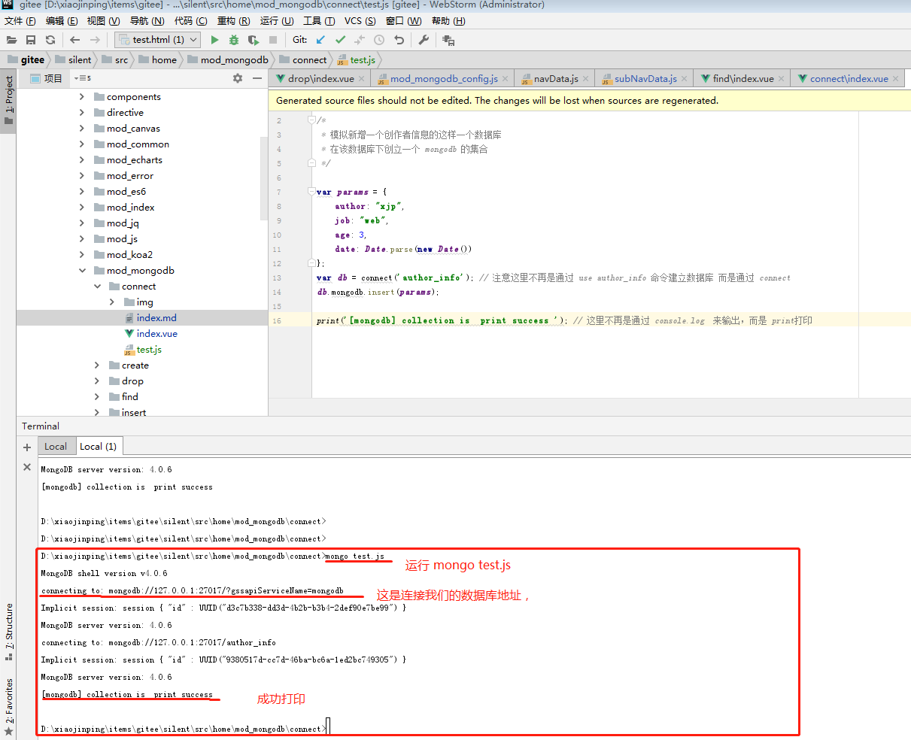

新建 test.js 文件，写入以下代码
```
/*
 * 模拟新增一个创作者信息的这样一个数据库
 * 在该数据库下创立一个 mongodb 的集合
 */
var params = {
    author: "xjp",
    job: "web",
    age: 3,
    date: Date.parse(new Date())
};
var db = connect('author_info'); // 注意这里不再是通过 use author_info 命令建立数据库 而是通过 connect
db.mongodb.insert(params);

print('[mongodb] collection is  print success '); // 这里不再是通过 console.log  来输出，而是 print打印
```
注意，我在代码里用的是var声明，而不是let声明方式, 在 3.x 版本中， mongodb 对 ES6 的支持不是很好

如果代码编辑器可以执行命令，在该文件目录运行当前文件
如果编辑器不支持运行命令，则可通过 cmd 的命令，在文件目录下运行该文件也是一样的。

```
mongo test.js
```



通过上图可以看到执行已经成功，如果对结果有疑问，也可以运行 cmd ,  通过 db.mongodb.find() 去看下是否执行成功。
