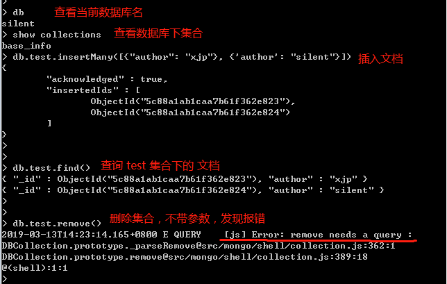

### remove() 方法的基本语法格式如下所示：
```mongoDB
db.collection.remove(
   <query>,
   <justOne>
)
```

如果你的 MongoDB 是 2.6 版本以后的，语法格式如下：

```mongoDB
db.collection.remove(
   <query>,
   {
     justOne: <boolean>,
     writeConcern: <document>
   }
)
```

### 参数说明：

query : 删除的文档的条件。有资料说这是一个可选参数，但是我认为他更应该是一个必选参数。
justOne : （可选）如果设为 true 或 1，则只删除一个文档，如果不设置该参数，或使用默认值 false，则删除所有匹配条件的文档。
writeConcern :（可选）抛出异常的级别。


### 实例
---
<br />

#### query 查询参数说明
首先，在一个新的集合里，插入两条数据，简单一点的吧。

```mongoDB
> db.test.insert([{"author": "xjp"}, {'author': "silent"}])
```

使用 find() 查询是否成功插入文档 此步骤省略

在之前的参数说明里，我说query是一个必选的参数，现在，我们来验证下,

```MongoDB
> db.test.remove() // 首先，我们不给 remove 传参

```


结果显示, remove的查询参数是必选的。

那么，这个查询参数是怎么写的。

第一种，删除所有文档，也就是在很多资料上说的不传参数，

```mongoDB
> db.test.find() // 删除之前，先查询，看下是不是有数据。
{{"_id": Object("5c88a1ab1caa7b61f362e823")},{"author": "xjp"}}
{{"_id": Object("5c88a1ab1caa7b61f362e824")},{"author": "silent"}}
> db.test.remove({}) // 注意，这里不是不传参数，而是传入了一个空的对象，意思是匹配所有的对象。
WriteResult({"nRemoved": 2})
> db.test.find()
>              // 注意，这里的结果是个空，而不是没有结果。
```

第二种，指定查询的参数,例如：我想删除所有 author 是 xjp 的文档

首先，给 test 插入两个文档，这个步骤省略

```MongoDB
> arr = [{
        "_id": "001",
         "author": "xjp"
    }, {
        "_id": "002",
        'author': "silent"
    },{
        "_id": "003",
        "author": "xjp"
    }]
> db.test.insert(arr)
BulkWriteResult({
        "writeErrors" : [ ],
        "writeConcernErrors": [ ],
        "nInserted": 3,
        "nUpserted": 0,
        "nMatched": 0,
        "nModified": 0,
        "nRemoved": 0,
        "upserted": [ ]
})
> db.test.find()
{"_id": "001", "author": "xjp"}
{"_id": "002", 'author': "silent"}
{"_id": "003", "author": "xjp"}
> db.test.remove({"author": "xjp"})
WriteResult({"nRemoved": 2})
```

结果发现，所有符合条件的数据都删除了。

####  justOne 如果我只想删除第一条找到的记录可以设置 justOne 为 1，如下所示：
<br />

```MongoDB
> db.test.remove({"author": "xjp"}, 1) // 这里的1表示的是true, 不是表示第几个，也不是表示删除几个。仅仅表示布尔值
```
>
```