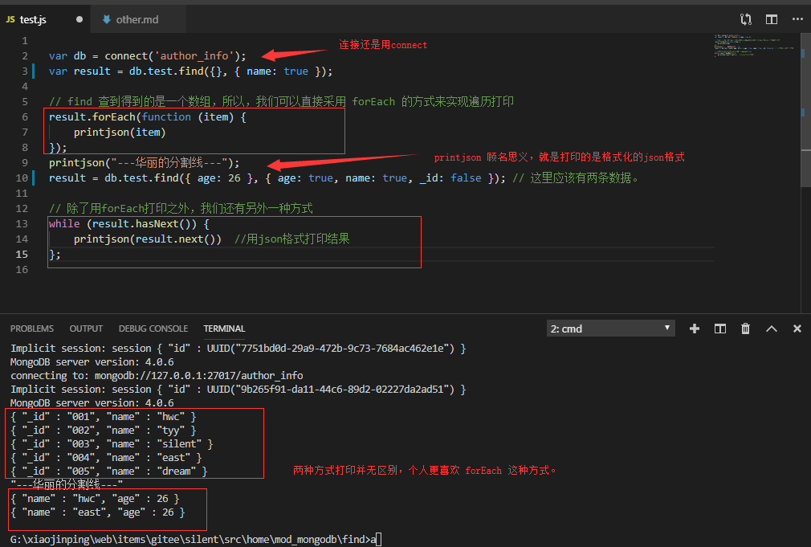

### find 命令如何在js文档中使用。

前边使用find 都是运行在终端，如果在js中运行，是不能显示出结果的。对于一个项目而言，是没有影响。

但是我就是想知道怎么运行js文件的时候，显示find 查找到的结果。


```mongodb

var db = connect('author_info');
var result = db.test.find({}, {name: true});
// find 查到得到的是一个数组，所以，我们可以直接采用 forEach 的方式来实现遍历打印
result.forEach(function (item) {
    printjson(item)
});
printjson("---华丽的分割线---");
result = db.test.find({age:26}, {age: true, name: true, _id: false}); // 这里应该有两条数据。
// 除了用forEach打印之外，我们还有另外一种方式
while (result.hasNext()) {
    printjson(result.next())  //用json格式打印结果
};

```

运行结果如图


