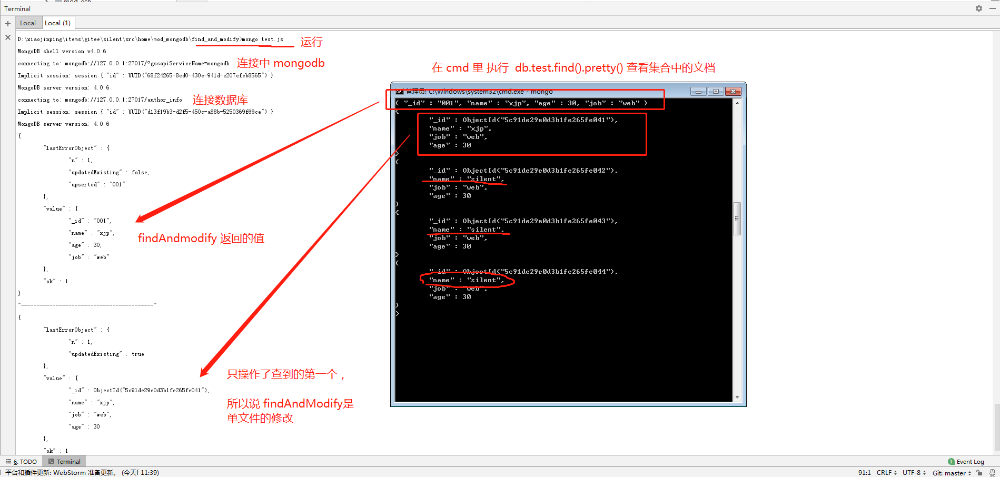

### db.runCommand( { <command> } ) 介绍

提供帮助程序以运行指定的数据库命令。这是发出数据库命令的首选方法，因为它在shell和驱动程序之间提供了一致的接口。

db.runCommand()在当前数据库的上下文中运行该命令。某些命令仅适用于admin数据库的上下文，您必须db在运行这些命令或使用之前将对象更改为db.adminCommand()。

详情请见 【[官方文档](https://docs.mongodb.com/manual/reference/method/db.runCommand/#db.runCommand)】
---
<br />


### findAndModify 基本语法
返回并修改单个文档，注意，这里是修改，我们将在 实例当中验证这点。

```mongodb
db.collection.findAndModify(); // 或者 db.runCommand({})  详情见实例
```


### 实例：

新建 test.js 文件，写入以下代码
```
/*
 * 模拟新增一个创作者信息的这样一个数据库
 * 在该数据库下创立一个 mongodb 的集合
 */
var params = {
    _id: '001',
    name: "xjp",
    job: "web",
    age: 30
};
var db = connect('author_info'); // 注意这里不再是通过 use author_info 命令建立数据库 而是通过 connect
var myModify = {
    findAndModify:"test", // 操作的集合， 这里也可以采用 db.test.findAndModify({query, update, upsert, new,……})
    query:{name:'xjp'}, // 查找的内容
    update:{$set:params}, // 设置的值
    upsert: true, // 如果不存在，直接插入，如果存在，不做操作。
    new:true    // 更新完成，需要查看结果，如果为false不进行查看结果
};
var ResultMessage = db.runCommand(myModify); // 使用 runCommand 来运行命令 他会返回他的处理结果。
printjson(ResultMessage);
printjson("------------------------------------------")
// 华丽的分割线，下面的代码是为了验证 findAndModify 是否能修改多个文档。
params = {
    name: "silent",
    job: "web",
    age: 30
};
db.test.insert([params, params, params,params]); // 插入了4个相同的文档。
myModify = { // 对所有的 silent  替换 成 xjp ，发现，他只是操作成功了第一个数据。
    findAndModify:"test",
    query:{name:'silent'},
    update:{$set:{name: 'xjp'}},
    multi: true, // 即使 multi 是 true,  也只会对查找到的第一个文档做操作。
    new:true
};

ResultMessage = db.runCommand(myModify);
printjson(ResultMessage);
```

运行 mongo 命令
```script
mongo  test.js
```

运行的结果 如下图：



