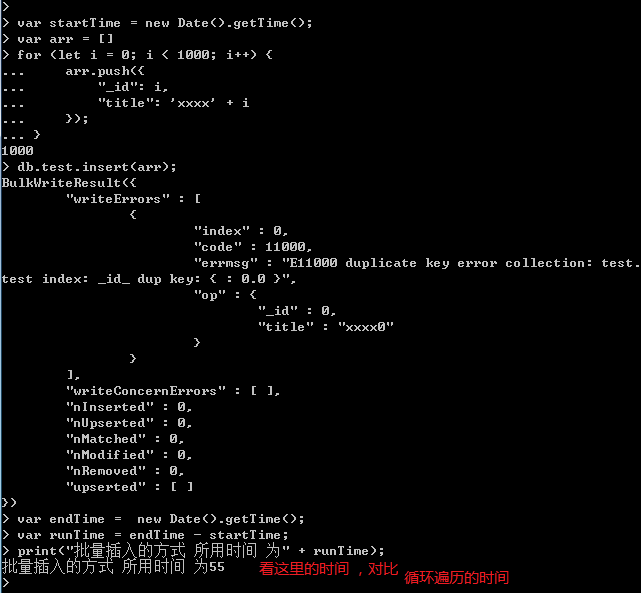
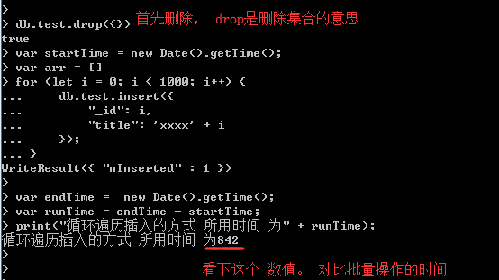

### MongoDB 插入文档
本章节中我们将向大家介绍如何将数据插入到MongoDB的集合中。

文档的数据结构和JSON基本一样。

所有存储在集合中的数据都是BSON格式。


### 插入文档
---
<br >
MongoDB 使用 insert() 或 save() 方法向集合中插入文档，语法如下：

db.COLLECTION_NAME.insert(document)

实例
以下文档可以存储在 MongoDB 的 silent 数据库 的 base_info 集合中：

```
db.base_info.insert({
    "_id": "001",
    "title": "jp1024",
    "url": "http://www.jp1024.com",
    "author": "silent"
})
```

我们也可以将数据定义为一个变量，就如同写js代码一样，如下所示：

```javascript
document = {
    "_id": "001",
    "title": "jp1024",
    "url": "http://www.jp1024.com",
    "author": "silent"
}
db.base_info.insert(document)
 ```

以上实例中 base_info 是我们的集合名，如果该集合不在该数据库中， MongoDB 会自动创建该集合并插入文档。

查看已插入文档：

```
> db.base_info.find()
{"_id": '001', "title": "jp1024", "url": "http://www.jp1024.com", "authro": "silent"}
```


插入文档你也可以使用 db.base_info.save(document) 命令。如果不指定 _id 字段 save() 方法类似于 insert() 方法。如果指定 _id 字段，则会更新该 _id 的数据。


### 替换文档 save()
---
<br >

```js
> db.base_info.save({"_id": "001", "author": "XJP"})
WriteResult({"nMatched": 1, "nUpserted": 0, "nModified": 1}
db.base_info.find()
{"_id": "001", "author": "XJP"}
```
发现没有，指定id的情况下，整个文档都替换了。


### 更新文档 update()
---
<br >

```js

> db.base_info.update({"_id": "001"}, {$set: {"title": "JP1024", "url": "www.jp1024.com"}})
WriteResult({"nMatched": 1, "nUpserted": 0, "nModified": 1}
> db.base_info.find()
{"_id": '001', "authro": "XJP", "title": "JP1024", "url": "www.jp1024.com"}
```

整个文档， author字段保留没变，新增了title字段，url字段。

注意到了没有，在update的语法中，有使用$set修饰，如果不用$set会发生什么，

```mongodb
> db.base_info.update({"_id": "001"}, {"authro": "silent"})
WriteResult({"nMatched": 1, "nUpserted": 0, "nModified": 1}
> db.base_info.find()
{"_id": '001', "authro": "XJP", "title": "JP1024", "url": "www.jp1024.com"}
```

从结果上看，不采用任何修饰词，其效果赞同于 save() 方法。关于 update在后面还会有更详尽的介绍


### 疑问
在上面的实例当中，我们插入的都是一个文档，如果我想同时插入多个文档，要怎么处理。


 db.collection.insertOne():向指定集合中插入一条文档数据 可以直接用 insert()
 db.collection.insertMany():向指定集合中插入多条文档数据

 在高版本中，insert() 这一个方法就能满足以上两个方法的功能。
 低版本中， db.collection.batchInsert() 可以批量插入


###  批量插入与遍历插入
---
<br />

```mongodb
> db.base_info.insertMany([{"author": "xjp"}, {'author': "silent"}])
> db.base_info.find()
```

我们看到，base_info 集合中多了两个文档对象

批量插入与循环插入的对比，

首先声明一个数组
```javascript
var startTime = new Date().getTime();
var arr = []
for (let i = 0; i < 1000; i++) {
    arr.push({
        "_id": i,
        "title": 'xxxx' + i
    });
}
db.test.insert(arr);
var endTime =  new Date().getTime();
var runTime = endTime - startTime;
print("批量插入的方式 所用时间 为" + runTime);
```

我们再来尝试下循环遍历插入的方式 

```javascript
db.test.drop({})
var startTime = new Date().getTime();
var arr = []
for (let i = 0; i < 1000; i++) {
    db.test.insert({
        "_id": i,
        "title": 'xxxx' + i
    });
}

var endTime =  new Date().getTime();
var runTime = endTime - startTime;
print("循环遍历插入的方式 所用时间 为" + runTime);

```

批量插入与遍历插入执行结果对比




