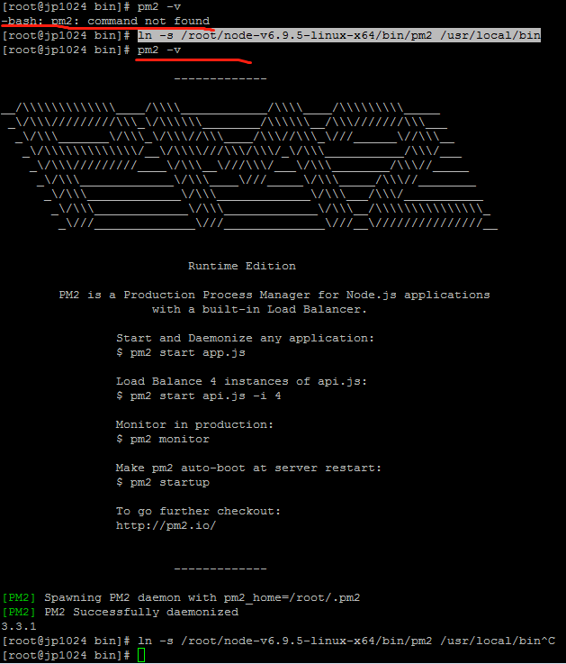

### 运行node service

node已经部署完毕，如何运行。在本地服务器里，我们是直接运行 node filename 就可以启动 node 服务，

在这里，也可以这样，

node 文件名  例如：node index.js 可以暂时开启服务。
forever 命令可以后台运行node 命令：forever start index.js
或者安装一个pm2 命令  pm2 start app.js  --watch

首先，做个测试。

复制如下代码：

```script
const http = require('http');
const hostname = '0.0.0.0';
const port = 3000;
const server = http.createServer((req, res) => {
res.statusCode = 200;
res.setHeader('Content-Type', 'text/plain');
res.end('Hello World\n');
});
server.listen(port, hostname, () => {
console.log(`Server running at http://${hostname}:${port}/`);
});
```

在任意位置建立一个 index.js 文件，文件名可以自定义

```script
vim index.js
```

熟悉vim的，可以不看。
按i键进入编辑模式，
然后 ctrl + v 或者 右击，或者 shift + insert 将复制的内容粘贴
最后，按 Esc 输入 :wq 才会保存并退出。 注意，按完esc的时候，并没有退出，只有输入 :wq的时候，才是保存并退出。

```script
node index.js
```

或者

```script
node index.js &
```

此时， node服务已经启动。

去浏览器里做个测试，输入 http://ip:3000，应该会有一个 hello word.

<br />

上面的过程只是测试node 环境有没有部署后，退出ssh后，服务就会停止。

如果需要 让服务在退出ssh后继续运行，需要用 forever 命令


### 安装forever

```script
 sudo npm install -g forever
```
 或者

```script
npm install -g forever
```

在执行 sudo npm install -g forever 时有可能会报错。例如：

```script
-base forever: command not found
```

可能存在的问题： node版本太低。
如果确认node版本没问题，估计就是软连接的问题。

```script
ln -s /root/node-v6.9.5-linux-x64/bin/forever  /usr/bin/forever
```

安装完成 后。

执行：forever start index.js  即可后台运行服务，

```script
forever start index.js
```

### 安装pm2

 成功安装 pm2 后，运行 pm2 start index.js  --watch 即可让 index.js 一直运行。

```script
npm install pm2 -g
pm2 -v

```

 执行结果如果是：pm2 command not found ，则表示pm2没有加入环境变量

 ```script
 [root@jp1024 ~]# pm2 -v
 -bash: pm2: command not found
 ```

 找到pm2的路径 。这个路径一般在 node-v6.9.5-linux-x64/bin 里面。其实在安装的时候，也有提示这个地址

 ```script

 ```

 ```script
  ln s pm2安装路径   /usr/local/bin/ `
 ```

 ```script
ln -s /root/node-v6.9.5-linux-x64/bin/pm2 /usr/local/bin
pm2 -v
 ```

运行服务
pm2 start app.js  --watch

安装成功后，pm2 -v结果：




